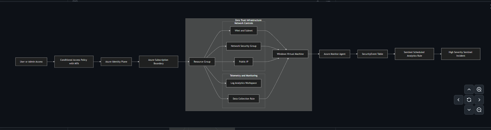
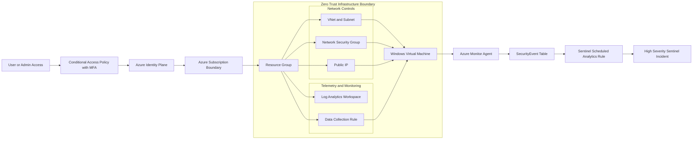

# Azure Zero Trust Detection Engineering Lab  

Terraform • Microsoft Defender • Microsoft Sentinel • Conditional Access • KQL

An Azure security engineering lab demonstrating Zero Trust identity enforcement, infrastructure isolation, endpoint telemetry ingestion, detection engineering, and incident generation. Infrastructure is provisioned using Terraform and integrated with Microsoft Sentinel for centralized monitoring and response.  

The lab validates an end-to-end detection pipeline from failed Windows logon activity (Event ID 4625) to an automatically generated high-severity Sentinel incident aligned to MITRE ATT&CK T1110 (Brute Force).

## Architecture



<details>

<summary>Mermaid Source (Click to Expand)</summary>



</details>

## What Was Built

- Terraform resources:

	- Resource Group (rg-zt-sentinel-lab-2jke2)
	- Virtual Network and subnet
	- Network Security Group
	- Public IP
	- Windows Virtual Machine (LiaBing0)
	- Log Analytics Workspace (law-zt-sentinel-lab-2jke2`)
- Security monitoring stack:
	- Microsoft Sentinel enabled on the Log Analytics Workspace
	- Azure Monitor Agent (AMA) on the Windows VM
	- Data Collection Rule (DCR) to ingest Windows Security Events

## Zero Trust Controls

- Conditional Access policy enforces MFA for targeted users/groups and selected cloud apps.
- Safety exclusions are applied for break-glass/admin continuity and controlled testing.
- Policy objective: verify identity assurance before access, consistent with Zero Trust principles.

## Security Architecture Principles

- Identity-first access validation (MFA enforcement before control plane access)
- Least privilege network exposure (NSG + controlled RDP access)
- Continuous verification via endpoint telemetry
- Centralized detection and incident correlation in Sentinel
- MITRE-aligned detection strategy

## Telemetry and Ingestion

- Windows Security Event logs are collected through AMA using a DCR association to `LiaBing0`.
- Ingestion validation query:

```kql
SecurityEvent
| take 10
```

- Validation confirms SecurityEvent records are successfully ingested and queryable within the workspace.

## Detection Engineering

- Detection objective: identify potential RDP brute-force behavior through temporal aggregation of failed logon events (Event ID 4625).
- Scheduled analytics rule uses Event ID `4625` with threshold `>= 3` failures in `5m`.
- Rule configuration:
	- Type: Scheduled analytics rule
	- Frequency: every 5 minutes
	- Lookback: last 5 minutes
	- Severity: High
	- MITRE ATT&CK: `T1110 Brute Force` (Credential Access)

Scheduled Analytics Rule Query:

```kql
SecurityEvent
| where EventID == 4625
| where TimeGenerated >= ago(5m)
| summarize FailedLogons = count() by Account = tostring(TargetUserName), Host = tostring(Computer)
| where FailedLogons >= 3
```

## Evidence

- [Resource group deployment](docs/images/01-resource-group-deployment.png)
- [Sentinel connected to workspace](docs/images/02-sentinel-connected.png)
- [DCR created and associated](docs/images/03-dcr-configured.png)
- [Log Analytics SecurityEvent ingestion validation](docs/images/05-securityevent-ingestion.png)
- [Event ID 4625 failed logon evidence](docs/images/06-eventid-4625-evidence.png)
- [Incident created in Sentinel](docs/images/07-incident-created.png)

## Repository Structure

```text
.
├─ README.md
├─ docs/
│  ├─ architecture.md
│  ├─ detection.md
│  ├─ zero-trust.md
│  ├─ operations.md
│  │
│  └─ images/
│       ├── 01-resource-group-deployment.png
│       ├── 02-sentinel-connected.png
│       ├── 03-dcr-configured.png
│       ├── 04-dcr-associated-vm.png
│       ├── 05-securityevent-ingestion.png
│       ├── 06-eventid-4625-evidence.png
│       ├── 07-incident-created.png
└─ terraform/
	 ├─ main.tf
	 ├─ providers.tf
	 ├─ variables.tf
	 └─ outputs.tf
```

## Cost, Teardown, and Safety

- This lab incurs Azure consumption costs (VM compute, storage, log ingestion, and Sentinel analytics).
- Destroy all provisioned infrastructure when finished:

```bash
terraform destroy
```

- Safety notes:
  
	- Do not commit secrets, credentials, or environment files containing sensitive values.
	- Do not publish screenshots containing passwords, token values, subscription IDs, tenant IDs, or public IP addresses.

## Lessons Learned

- Telemetry integrity and configuration accuracy directly determine detection reliability and alert fidelity.
- Simple threshold rules are effective for demonstrating detection pipelines, but need tuning to reduce false positives.
- Conditional Access design requires a security-vs-availability balance, including explicit break-glass exceptions.

## Next Phase - Endpoint Detection, Correlation, and Automation

Planned expansion of this lab includes:

- Onboarding the Windows VM to Microsoft Defender for Endpoint (EDR)
- Integrating Defender for Endpoint alerts into Microsoft Sentinel
- Correlating authentication telemetry (Event ID 4625) with endpoint behavioral detections
- Ingesting Microsoft Defender for Cloud alerts into Sentinel for broader signal visibility
- Implementing Sentinel playbooks for automated enrichment and notification
- Adding GeoIP enrichment to identify suspicious sign-in source locations
