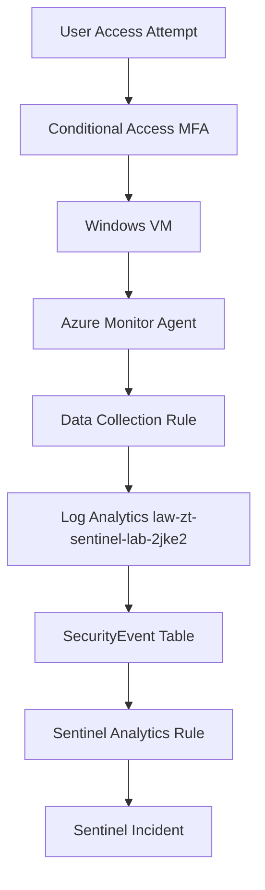

# Architecture

This lab deploys a scoped Azure environment with Terraform and routes Windows security telemetry into Microsoft Sentinel for detection and incident creation. Conditional Access enforces MFA at access time, while AMA + DCR provide data-plane visibility from the VM into the `SecurityEvent` table.

## Components

- `rg-zt-sentinel-lab-2jke2`: logical container for all lab assets.
- Network layer: VNet/subnet + NSG + Public IP to host and manage the test VM.
- `LiaBing0`: Windows endpoint used to generate authentication telemetry.
- `law-zt-sentinel-lab-2jke2`: Log Analytics Workspace storing collected logs.
- AMA + DCR: collection pipeline for Windows Security Events.
- Microsoft Sentinel: analytics, alerting, and incident management.

## Data Flow

1. User sign-in is evaluated by Conditional Access MFA policy.
2. Activity on `LiaBing0` generates Windows Security Events (including Event ID 4625).
3. AMA collects events according to DCR configuration.
4. Events are ingested into `law-zt-sentinel-lab-2jke2` (`SecurityEvent` table).
5. Sentinel scheduled analytics rule evaluates query conditions.
6. Matching results generate an alert and create an incident.

## Diagram

